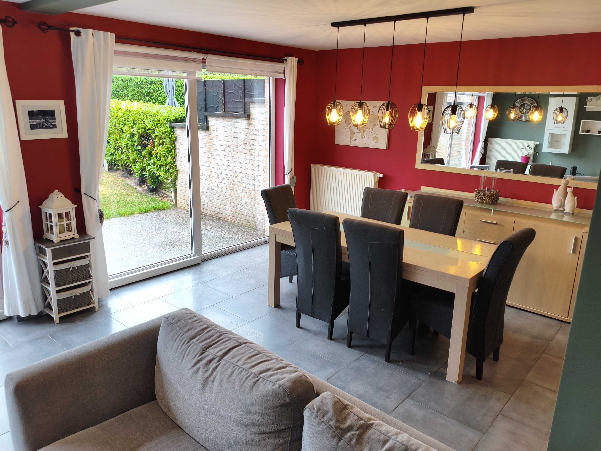
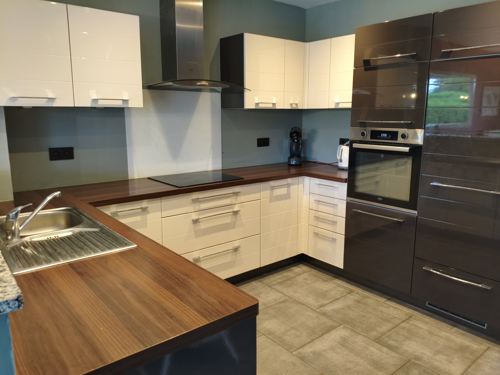

<!DOCTYPE html>
<html lang="fr">

<head>
    <meta charset="UTF-8">

    <meta name="viewport" content="width=device-width, initial-scale=1.0">

    <title>À louer | Maison 4 chambres avec jardin</title>

    <meta name="description"
        content="À louer : maison familiale 4 chambres avec jardin, terrasse, garage et grand grenier semi-aménagé, située dans un clos résidentiel calme.">

    

</head>

<body>

<!-- =====================================================
     HERO
===================================================== -->

<header class="hero">

    

        

            À LOUER
        

        <h1>
            Maison familiale
        </h1>

        

            🛏️ 4 chambres

            🌿 Jardin

            ☀️ Terrasse

            🚗 Garage

        

        

            Une maison où il fait bon vivre,
            située dans un clos résidentiel calme
            et proche de toutes les commodités.

        

        

            📍 Un environnement paisible,
            proche des principaux axes routiers

        

        

            <a
                href="#contact"
                class="btn primary"
            >
                📅 Demander une visite
            </a>

            <a
                href="#photos"
                class="btn light"
            >
                Découvrir la maison
            </a>

        

    

    

</header>

<!-- =====================================================
     INTRODUCTION
===================================================== -->

<section class="intro">

    

        

            

                Le cadre de vie
            

            

                Le calme d'un clos résidentiel,
                le confort d'une vraie maison familiale.

            

        

        

            

                Vous recherchez une maison confortable,
                fonctionnelle et idéalement située ?

            

            

                Cette agréable habitation vous offre
                un cadre de vie paisible tout en restant
                proche de tout ce dont vous avez besoin
                au quotidien.

            

            

                Écoles, commerces, clubs sportifs
                et principaux axes routiers sont
                facilement accessibles.

            

        

    

</section>

<!-- =====================================================
     COMPOSITION
===================================================== -->

<section class="composition">

    

        

            

                La maison
            

            <h2>
                Des espaces pensés pour toute la famille.
            </h2>

            

                Une organisation agréable sur trois niveaux,
                avec de beaux volumes et de nombreux espaces
                pratiques.

            

        

        

            <!-- REZ-DE-CHAUSSEE -->

            

                

                    Rez-de-chaussée
                

                <h3>
                    Vie quotidienne
                </h3>

                <ul>

                    <li>Hall d'entrée</li>

                    <li>WC séparé</li>

                    <li>Séjour avec vue sur le jardin</li>

                    <li>Cuisine ouverte équipée</li>

                    <li>Buanderie</li>

                    <li>Garage 1 voiture</li>

                    <li>Terrasse & jardin</li>

                </ul>

            

            <!-- PREMIER ETAGE -->

            

                

                    1er étage
                

                <h3>
                    Espace nuit
                </h3>

                <ul>

                    <li>4 grandes chambres</li>

                    <li>1 salle de bain</li>

                    <li>Espaces généreux</li>

                    <li>Ambiance calme</li>

                </ul>

            

            <!-- DEUXIEME ETAGE -->

            

                

                    2e étage
                

                <h3>
                    Grenier
                </h3>

                <ul>

                    <li>Grand grenier semi-aménagé</li>

                    <li>Espace de rangement</li>

                    <li>Possibilité de bureau</li>

                    <li>Idéal comme salle de jeux</li>

                    <li>Espace à aménager selon vos besoins</li>

                </ul>

            

        

    

</section>

<!-- =====================================================
     POINTS FORTS
===================================================== -->

<section class="features">

    

        

            

                Les + de la maison
            

            <h2>
                Le confort au quotidien.
            </h2>

        

        

            

                

                    ☀️
                

                <strong>
                    Panneaux photovoltaïques
                </strong>

                

                    Une installation qui contribue
                    à améliorer l'efficacité énergétique
                    de la maison.

                

            

            

                

                    🔥
                

                <strong>
                    Nouvelle chaudière
                </strong>

                

                    Nouvelle chaudière
                    à condensation au gaz.

                

            

            

                

                    🌿
                

                <strong>
                    Jardin & terrasse
                </strong>

                

                    Un agréable espace extérieur
                    pour profiter des beaux jours.

                

            

            

                

                    🚗
                

                <strong>
                    Garage
                </strong>

                

                    Un garage permettant
                    de stationner une voiture à l'abri.

                

            

        

    

</section>

<!-- =====================================================
     GALERIE
===================================================== -->

<section
    class="gallery-section"
    id="photos"
>

    

        

            

                Galerie
            

            <h2>
                Découvrez la maison.
            </h2>

            

                Quelques premières vues des espaces
                de vie. D'autres photos seront ajoutées
                prochainement.

            

        

        

            

                

            

            

                

                    

                

                

                    

                

            

        

    

</section>

<!-- =====================================================
     ENVIRONNEMENT
===================================================== -->

<section class="environment">

    

        

            

                Emplacement
            

            <h2>
                Au calme, sans être isolé.
            </h2>

            

                La maison profite d'un environnement
                résidentiel agréable tout en permettant
                de rejoindre facilement les commodités
                et les principaux axes.

            

        

        

            

                <strong>
                    🏫 Écoles
                </strong>

                À proximité pour faciliter
                le quotidien familial.

            

            

                <strong>
                    🛍️ Commerces
                </strong>

                Les commerces et services
                sont facilement accessibles.

            

            

                <strong>
                    ⚽ Clubs sportifs
                </strong>

                Une offre de loisirs et d'activités
                à proximité.

            

            

                <strong>
                    🛣️ Axes routiers
                </strong>

                Accès pratique aux principaux
                axes de circulation.

            

        

    

</section>

<!-- =====================================================
     CONTACT
===================================================== -->

<section
    class="contact"
    id="contact"
>

    

        

            

                Location
            

            <h2>
                Et si cette maison devenait la vôtre ?
            </h2>

            

                Une maison familiale qui combine
                espace, confort, tranquillité
                et praticité.

            

            

                Vous souhaitez obtenir davantage
                d'informations ou organiser une visite ?

            

        

        

            <strong>
                Intéressé(e) ?
            </strong>

            

                Contactez-nous pour recevoir
                les informations complémentaires
                et convenir d'une visite.

            

            <!--
                IMPORTANT :
                Remplacez l'adresse ci-dessous
                par votre véritable adresse e-mail.
            -->

            <a
                href="mailto:mf6306@hotmail.com"
                class="btn"
            >

                ✉️ Nous contacter

            </a>

        

    

</section>

<!-- =====================================================
     FOOTER
===================================================== -->

<footer>

    

        Maison 4 chambres à louer
        · Clos résidentiel

    

</footer>

</body>

</html>
